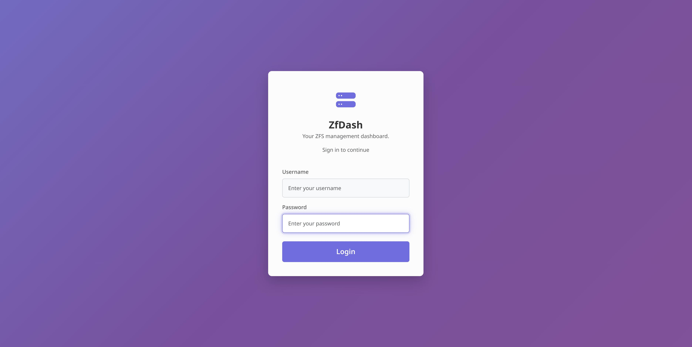
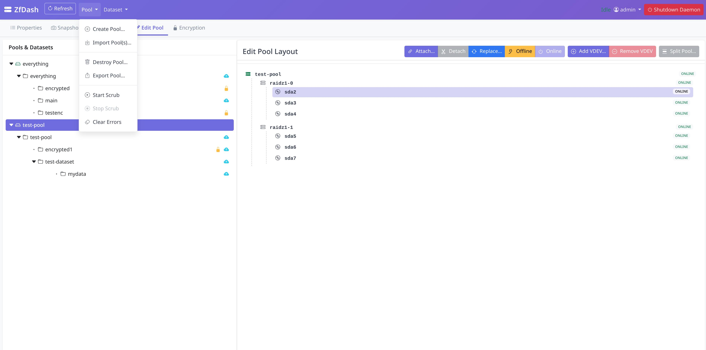
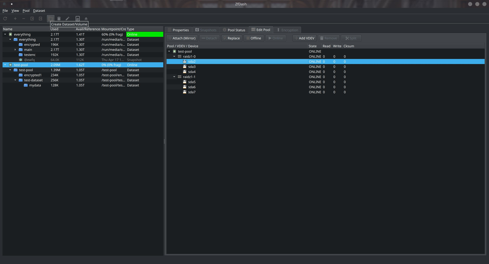

# ZfDash - 现代 ZFS 管理图形界面与 Web UI

[](https://github.com/Jioyzen/zfdash-zh-cn/releases)
[](https://www.gnu.org/licenses/gpl-3.0)
[](https://github.com/Jioyzen/zfdash-zh-cn)

> 🆕 **v2.0.0 新特性：** 完整的**备份与复制**系统，支持代理到代理、本地、SSH 和文件导出模式 —— 还有**代理模式**用于从单一控制中心管理多台主机的 ZFS！

**一款强大、易用的 ZFS 存储池、数据集和快照管理工具，同时提供桌面 GUI 和 Web UI 界面。**

ZfDash 通过直观的图形界面简化了 Linux、macOS 和 FreeBSD 上的 ZFS 管理。使用 Python 构建并采用安全的守护进程架构，无需命令行专业知识即可提供全面的 ZFS 管理能力。

---

## 🚀 快速开始

**一键安装（仅限 Linux）：**
```bash
curl -sSL https://raw.githubusercontent.com/Jioyzen/zfdash-zh-cn/main/get-zfdash.sh | bash
```

**默认 Web UI：** http://127.0.0.1:5001 （登录：`admin`/`admin` - **请立即修改密码！**）

**更新：** 再次运行安装程序，或从帮助菜单检查更新。

---

## 目录

* [✨ 功能特性](#-功能特性)
* [📸 截图](#-截图)
* [⚙️ 系统要求](#️-系统要求)
* [🚀 安装与运行](#-安装与运行)
* [🐳 Docker 使用](#-docker-使用)
* [🔗 代理模式](#-代理模式)
* [💡 使用教程](#-使用教程)
* [🗺️ 路线图](#️-路线图)
* [🤝 参与贡献](#-参与贡献)
* [💖 项目初衷](#-项目初衷)
* [⚠️ 重要警告](#️-重要警告)
* [📄 许可证](#-许可证)

## ✨ 功能特性

*   🔒 安全的后端守护进程（Polkit/`pkexec`）与管道/套接字通信。
*   💻 桌面 GUI（PySide6）与 🌐 Web UI（Flask/Waitress），支持安全登录（Flask-Login, PBKDF2）。
*   📊 存储池管理：查看状态、创建（各种VDEV类型）、销毁、导入、导出、数据校验、清除错误、编辑结构（添加/移除/附加/分离/替换等）、强制选项。
*   🌳 数据集/卷管理：树形视图、创建/销毁（递归）、重命名、查看/编辑属性、继承、提升、挂载/卸载。
*   📸 快照管理：查看、创建（递归）、删除、回滚、克隆。
*   💾 备份与复制：代理到代理、本地、SSH 和文件导出，支持任务跟踪、断点续传和自动增量基础检测。
*   🔐 加密支持：创建加密数据集、查看状态、管理密钥（加载/卸载/更改）。
*   🔑 密码保险库：安全存储代理凭据，退出时自动锁定。
*   📜 实用工具：可选的命令日志记录。

## 📸 截图

**Web UI：**




**桌面 GUI：**



## ⚙️ 系统要求

* **支持的平台：** Linux（x86_64 和 ARM64）。
* **实验性支持：** macOS 和 FreeBSD 在使用 uv 从源码运行时有实验性支持（方法2）。需要 `sudo`，建议使用 `--socket` 模式。**注意：** FreeBSD 仅支持 Web UI（无 GUI）。所有功能预期可正常工作。
* **ZFS 已安装并配置**（已测试 zfs-2.3.1。`zfs` 和 `zpool` 命令必须可被 root 执行）。
* **Python 3**（开发/测试版本：3.10-3.13）。

## 🚀 安装与运行

*默认 WebUI：http://127.0.0.1:5001，登录：`admin`/`admin`（请立即修改密码！）*

**方法1：预构建发布版（仅限 Linux `x86_64` 和 `ARM64`）**

运行此命令自动下载并安装/更新适合您系统的最新版本：
```bash
curl -sSL https://raw.githubusercontent.com/Jioyzen/zfdash-zh-cn/main/get-zfdash.sh | bash
```

*  启动 GUI：应用菜单/`zfdash`，启动 Web UI：`zfdash --web [--host <ip>] [--port <端口号>]`，帮助：`zfdash --help`
*  卸载：`sudo /opt/zfdash/uninstall.sh`（*注意：安装程序通常会使其可执行*）

或下载适合您系统的最新发布包并运行 `install.sh`。

**方法2：使用 uv 从源码运行（Linux, macOS, FreeBSD）**

**Linux：**

```bash
# 安装 uv
curl -LsSf https://astral.sh/uv/install.sh | sh

# 克隆仓库
git clone https://github.com/Jioyzen/zfdash-zh-cn && cd zfdash-zh-cn

# 运行 Web UI
uv run src/main.py --web
```
```bash
# 或运行 GUI
uv run src/main.py
```

**macOS/FreeBSD（实验性）：**

*要求：`sudo` 已安装并配置（macOS 默认有）*

```bash
# 安装 uv
curl -LsSf https://astral.sh/uv/install.sh | sh

# 克隆仓库
git clone https://github.com/Jioyzen/zfdash-zh-cn && cd zfdash-zh-cn

# 运行 Web UI（推荐：使用 --socket 模式以获得更好的兼容性）
uv run src/main.py --web --socket
# 系统将提示您输入 sudo 以启动守护进程
```
```bash
# 或运行 GUI（仅 macOS，FreeBSD 不支持）
uv run src/main.py --socket
```

**注意：**
- `--socket` 模式使用 Unix 套接字代替管道进行守护进程通信（在 BSD 系统上更可靠）
- 如果您在这些平台上测试，请报告问题。查看：`uv run src/main.py --help` 了解所有选项。

* **故障排除：** 如果守护进程因 Polkit/策略问题无法启动，请将打包的策略文件复制到系统操作目录：
```bash
sudo cp src/data/policies/org.zfsgui.pkexec.daemon.launch.policy /usr/share/polkit-1/actions/
sudo chown root:root /usr/share/polkit-1/actions/org.zfsgui.pkexec.daemon.launch.policy
sudo chmod 644 /usr/share/polkit-1/actions/org.zfsgui.pkexec.daemon.launch.policy
```
然后重试。

**方法3：从源码构建（桌面/手动 WebUI）**

1.  `git clone https://github.com/Jioyzen/zfdash-zh-cn && cd zfdash-zh-cn`
2.  `chmod +x build.sh`
3.  `./build.sh`（自动安装 uv 并构建）
4.  `chmod +x install.sh`
5.  `sudo ./install.sh`
6.  启动/卸载：参见方法1。

**方法4：Docker（仅 Web UI - Linux x86_64 和 ARM64）**

在特权 Docker 容器中运行 ZfDash。

## 🐳 Docker 使用

这是部署 ZfDash Web UI 的推荐方法。

### 1. 从镜像仓库拉取镜像

镜像可在 Docker Hub 和 GitHub Container Registry (GHCR) 上获取。Docker Hub 是推荐的来源。

*   **从 Docker Hub（推荐）：**
    ```bash
    sudo docker pull jioyzen/zfdash-zh-cn:latest
    ```

*   **从 GitHub Container Registry（备选）：**
    ```bash
    sudo docker pull ghcr.io/jioyzen/zfdash-zh-cn:latest
    ```

### 2. 运行容器

此命令启动容器并使用 Docker **命名卷**（`zfdash_config` 和 `zfdash_data`）安全地持久化您的应用程序配置和数据。

```bash
sudo docker run -d --name zfdash \
  --privileged \
  --network=host \
  --device=/dev/zfs:/dev/zfs \
  -v zfdash_config:/root/.config/ZfDash \
  -v zfdash_data:/opt/zfdash/data \
  -v /etc:/host-etc:ro \
  -v /dev/disk:/dev/disk:ro \
  -v /run/udev:/run/udev:ro \
  -v ~/.ssh:/root/.ssh:ro \
  -p 5001:5001 \
  --restart unless-stopped \
  jioyzen/zfdash-zh-cn:latest
```

Docker Compose 栈也[已包含](compose.yml)。要使用它代替上述 Docker 命令：
```bash
sudo docker compose up -d
```

然后您可以在 `http://localhost:5001` 访问 Web UI。

停止并删除容器（如果使用 Docker 命令部署）：
```bash
sudo docker stop zfdash
sudo docker rm zfdash
```

如果使用 Docker Compose 部署（添加 `-v` 也会删除卷）：
```bash
sudo docker compose down
```

**HostID 兼容性说明**：ZFS 存储池会存储创建时系统的 hostid。为了防止 hostid 不匹配错误，容器通过 `-v /etc:/host-etc:ro` 挂载与主机的 `/etc/hostid` 同步（已包含在 compose 文件中）。这适用于所有发行版，能优雅处理缺失的 hostid 文件。

### 安全说明

Docker 容器以 `--privileged` 模式运行，这授予应用程序（Web UI 和后端守护进程）对主机系统的 root 级别访问权限。这是 ZFS 管理操作目前所必需的。

此配置适用于**可信的本地网络**和**家庭实验室环境**。请勿将此容器直接暴露在公共互联网上。

**未来路线图：**
*   将应用程序拆分为两个容器：特权守护进程容器和非特权 Web UI 容器，通过安全套接字 IPC 通信。
*   或者，实现 `s6-overlay` 配合 `s6-setuidgid` 在单容器内为 Web UI 进程降权。

**方法5：Web UI Systemd 服务（无头/服务器）**

**注意：** 暂不支持 Polkit < 0.106（即较旧的发行版）。

1.  先通过方法1或3安装 ZfDash。
2.  `cd install_service`
3.  `chmod +x install_web_service.sh`
4.  `sudo ./install_web_service.sh`（按提示进行设置）
5.  控制：`sudo systemctl [start|stop|status|enable|disable] zfdash-web`
6.  访问：`http://<服务器IP>:5001`（或配置的端口/主机）
7.  卸载服务：`cd install_service && chmod +x uninstall_web_service.sh && sudo ./uninstall_web_service.sh`

## 💡 使用教程

*   **启动：** 按照安装步骤操作。对于 Web UI，登录（`admin`/`admin`）并通过用户菜单**立即修改密码**。
*   **导航：** 左侧面板显示 ZFS 对象树。右侧面板通过选项卡（属性、快照等）显示所选对象的详情/操作。顶部栏/菜单有全局操作（刷新 🔄、创建、导入）和 Web UI 用户菜单。
*   **常见任务：** 在树中选择对象，然后使用右侧面板选项卡或顶部栏/菜单按钮。例如：检查存储池状态/属性选项卡以了解健康/使用情况。使用快照选项卡创建/删除/回滚/克隆。使用顶部栏/菜单创建数据集。使用加密选项卡管理密钥。
*   **请记住：** 破坏性操作不可逆。仔细检查选择并保持备份！

## 🔗 代理模式

代理模式允许您从单一的 ZfDash 控制中心管理远程主机上的 ZFS。在每台远程机器上运行代理，然后通过 Web UI 连接到它们。

### 运行 ZfDash 代理

**如果已安装 ZfDash：**
```bash
sudo zfdash --agent
```

**从源码运行（无依赖 > 使用 openssl 和 UDP 发现）：**
```bash
sudo python src/main.py --agent
```

**从源码完整设置（+ cryptography 和 mDNS 支持）：**
```bash
git clone https://github.com/Jioyzen/zfdash-zh-cn.git
cd zfdash-zh-cn
uv sync
sudo .venv/bin/python src/main.py --agent
```

**注意：**
- 代理默认监听 **5555** 端口并**启用 TLS**。
- 首次运行时（或如果不存在凭据），系统会提示您设置管理员密码；否则使用代理系统上现有的 Web UI 密码。
- 从 Web UI 导航栏下拉菜单打开**控制中心**来发现并连接代理。
- 网络发现通过 UDP 广播（始终）和 mDNS（如果代理可用，参见完整设置）自动发现代理。

## 🗺️ 路线图

### ⚡ 守护进程与架构功能
- [x] **持久化守护进程**：使用 `--launch-daemon` 分离运行守护进程。
- [x] **并发客户端**：守护进程现在在 --socket 模式下支持线程化和并发连接（GUI + WebUI 同时运行）。
- [x] **弹性重连**：客户端在连接断开时自动重新连接守护进程。
- [x] **跨平台支持**：Linux，实验性 macOS/FreeBSD 支持。

### 🎨 UI 与用户体验
- [x] **丰富的模态框**：现代 Bootstrap 模态框替代 WebUI 中的原生浏览器警告。
- [x] **可视化 VDEV 管理**：增强的 UI 用于添加/移除 VDEV（包括特殊/日志/去重）。
- [x] **上下文帮助**：ZFS 概念指导（VDEV 类型、RAIDZ 级别）。
- [x] **三按钮确认**：关键操作的更清晰安全对话框。
- [x] **智能过滤开关**："显示所有设备"选项供高级用户使用。

### 🌐 代理模式与远程管理
- [x] **TCP 传输**：安全的 TCP 通信基础。
- [x] **TLS 加密**：STARTTLS 协商用于安全的代理连接。
- [x] **身份认证**：带凭据的挑战-响应握手。
- [x] **Web UI "控制中心"**：管理远程代理的界面。
- [x] **代理发现**：自动发现本地网络上的代理（UDP 广播 + mDNS）。
- [x] **多服务器上下文**：在本地和远程 ZFS 服务器之间无缝切换。

### 💾 备份与复制功能
- [x] **ZFS Send/Receive**：数据复制的核心功能。
- [x] **备份任务管理器**：任务选项卡，支持状态跟踪、取消、删除和恢复。
- [x] **远程复制**：直接备份到其他 ZfDash 代理（代理到代理）。
- [x] **进度监控**：长时间传输任务的实时状态。
- [x] **多目标**：本地、SSH 和文件导出备份模式。
- [x] **增量备份**：通过快照 GUID 自动检测增量基础。

## 🤝 参与贡献

欢迎贡献！如果您想改进 ZfDash，请随时：

1. Fork 本仓库
2. 创建功能分支（`git checkout -b feature/your-feature`）
3. 进行更改并提交
4. 推送到您的分支（`git push origin feature/your-feature`）
5. 向 `main` 分支提交 Pull Request

请确保您的代码遵循现有风格并包含适当的注释。对于重大更改，考虑先提交 issue 讨论您的想法。

## 💖 项目初衷

作为一名执业医生，我的主要精力不在软件开发上，但我喜欢将探索 Python、Linux 和安全领域作为爱好。ZfDash 源于这个爱好和我自己管理 ZFS 存储的需求。

在 AI 工具的帮助下，我构建了这个 GUI/WebUI，并决定与开源社区分享，希望能帮助到其他人。虽然我的时间有限，但我致力于维护这个项目并欢迎社区贡献。无论是报告错误、建议功能、改进文档还是提交代码——都非常感谢您的帮助！请参阅下面的[参与贡献](#-参与贡献)部分了解如何参与。

## ⚠️ 重要警告

*   **开发者说明：** 由非专业人员作为个人爱好项目创建；请在理解可能存在的限制或错误的情况下使用。
*   **按原样使用 / 测试版：** 按原样提供，不作任何保证。这是测试版软件，可能包含错误。
*   **无责任：** 在任何情况下，作者/版权持有人均不对与软件相关的任何索赔、损害或其他责任负责。
*   **数据风险：** ZFS 操作可能具有破坏性（销毁、回滚等）。不当使用可能导致**永久性数据丢失**。
*   **用户责任：** 您对自己执行的命令和数据的完整性负全部责任。**始终保持可靠的、经过测试的备份。**
*   **安全：** 通过 Polkit 管理特权操作。仅在可信系统/网络上使用。**立即修改默认密码（`admin:admin`）。**

## 📄 许可证

本项目采用 GNU 通用公共许可证 v3.0 授权。

---

## 关于中文版

本仓库是 [ZfDash](https://github.com/ad4mts/zfdash) 的中文汉化版本，由社区维护。

- 原项目地址：https://github.com/ad4mts/zfdash
- 中文版维护：https://github.com/Jioyzen/zfdash-zh-cn